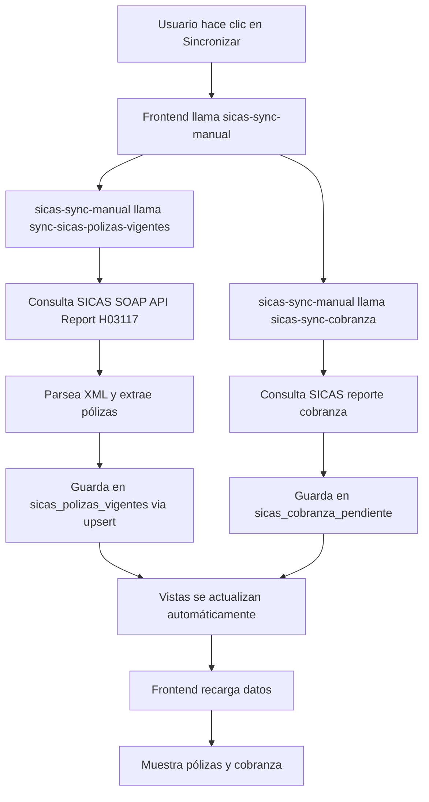

# Fix: Mi Producción SICAS - Sin Datos para Administrador

## Problema Reportado

En la página `/mi-produccion-sicas`, el Administrador no veía ninguna información. Todos los contadores aparecían en ceros y las listas de pólizas, cobranza y renovaciones estaban vacías.

## Diagnóstico Realizado

### 1. Verificación de Acceso y Permisos RLS

Se verificó que las políticas RLS estaban correctas:
```sql
-- Administrador tiene acceso completo
CREATE POLICY "Administrador ve todas las polizas SICAS"
  ON sicas_polizas_vigentes FOR SELECT
  USING (usuarios.rol = 'Administrador'...);
```

✅ Las políticas RLS tienen los roles correctos (`'Administrador'`, no `'admin'`)

### 2. Verificación de Datos en Tablas

Se consultó la base de datos directamente:
```sql
SELECT COUNT(*) FROM sicas_polizas_vigentes;        -- 0 registros
SELECT COUNT(*) FROM sicas_cobranza_pendiente;      -- 0 registros
SELECT COUNT(*) FROM sicas_renovaciones_proximas;   -- 0 registros
SELECT COUNT(*) FROM sicas_emitidas_mes_actual;     -- 0 registros
```

❌ **Causa raíz encontrada:** Las tablas están completamente vacías

### 3. Verificación del Sistema

Se confirmó que:
- ✅ Hay configuración de SICAS activa y probada exitosamente
- ✅ Hay 2 mapeos de vendedores configurados
- ✅ Existen los edge functions de sincronización
- ❌ **NUNCA se ha ejecutado la sincronización de datos desde SICAS**

## Causa Raíz del Problema

**Las tablas de producción SICAS están vacías porque nunca se han sincronizado los datos desde el sistema SICAS.**

La página `MiProduccionSICAS.tsx` hace queries directas a estas tablas:
- `sicas_polizas_vigentes`
- `sicas_cobranza_pendiente`
- `sicas_renovaciones_proximas` (vista)
- `sicas_emitidas_mes_actual` (vista)

Sin datos en las tablas base, todas las consultas retornan arrays vacíos, independientemente del rol del usuario.

## Solución Implementada

### 1. Mejorar Experiencia de Usuario (UX)

Se agregó un sistema de detección de datos vacíos con mensaje informativo prominente:

```typescript
// Estado para detectar si no hay datos
const [hasNoData, setHasNoData] = useState(false);

// useEffect para detectar cuando no hay datos
useEffect(() => {
  if (!loading) {
    const noData = polizas.length === 0 && cobranza.length === 0 &&
                   renovaciones.length === 0 && emisionesDelMes.length === 0;
    setHasNoData(noData);
  }
}, [loading, polizas, cobranza, renovaciones, emisionesDelMes]);
```

### 2. Banner Informativo Cuando No Hay Datos

Se agregó un banner azul prominente que aparece cuando no hay datos:

```tsx
{hasNoData && !loading && (
  <div className="mb-6 bg-blue-50 border-2 border-blue-200 rounded-lg p-6">
    <div className="flex items-start gap-4">
      <div className="w-12 h-12 bg-blue-100 rounded-full flex items-center justify-center">
        <AlertCircle className="w-6 h-6 text-blue-600" />
      </div>
      <div className="flex-1">
        <h3 className="text-lg font-semibold text-blue-900 mb-2">
          No hay datos de producción disponibles
        </h3>
        <p className="text-blue-800 mb-4">
          Para visualizar tus pólizas, cobranza y renovaciones, primero debes sincronizar
          los datos desde SICAS. Este proceso consultará el sistema SICAS y guardará
          la información en caché para consulta rápida.
        </p>
        <div className="flex flex-col sm:flex-row gap-3">
          <button onClick={handleSync} disabled={syncing}>
            <RefreshCw className={syncing ? 'animate-spin' : ''} />
            {syncing ? 'Sincronizando desde SICAS...' : 'Sincronizar Ahora'}
          </button>
          <div className="text-sm text-blue-700 bg-blue-100 px-4 py-2 rounded-lg">
            <Clock className="w-4 h-4" />
            La sincronización puede tardar 1-2 minutos
          </div>
        </div>
      </div>
    </div>
  </div>
)}
```

### 3. Mensajes de Feedback para Sincronización

Se mejoró la función `handleSync` para mostrar mensajes de éxito/error:

```typescript
const [syncMessage, setSyncMessage] = useState<{ type: 'success' | 'error'; text: string } | null>(null);

const handleSync = async () => {
  setSyncing(true);
  setSyncMessage(null);
  try {
    const response = await fetch(
      `${import.meta.env.VITE_SUPABASE_URL}/functions/v1/sicas-sync-manual`,
      {
        method: 'POST',
        headers: {
          'Authorization': `Bearer ${session?.access_token}`,
          'Content-Type': 'application/json',
        },
        body: JSON.stringify({ syncType: 'completa' }),
      }
    );

    const result = await response.json();

    if (response.ok && result.success !== false) {
      setSyncMessage({
        type: 'success',
        text: `Sincronización completada: ${result.polizas_vigentes || 0} pólizas, ${result.cobranza_pendiente || 0} cobranzas`
      });
      await loadData();
    } else {
      setSyncMessage({
        type: 'error',
        text: `Error en sincronización: ${result.error || 'Error desconocido'}`
      });
    }
  } catch (error: any) {
    setSyncMessage({
      type: 'error',
      text: `Error de conexión: ${error.message || 'No se pudo conectar con SICAS'}`
    });
  } finally {
    setSyncing(false);
  }
};
```

### 4. Banner de Feedback Visual

Se agregó un banner de mensajes de éxito/error:

```tsx
{syncMessage && (
  <div className={`mb-6 p-4 rounded-lg ${
    syncMessage.type === 'success'
      ? 'bg-green-50 border border-green-200 text-green-800'
      : 'bg-red-50 border border-red-200 text-red-800'
  }`}>
    <div className="flex items-start gap-3">
      {syncMessage.type === 'success' ? (
        <CheckCircle className="w-5 h-5 mt-0.5" />
      ) : (
        <AlertCircle className="w-5 h-5 mt-0.5" />
      )}
      <div className="flex-1">
        <p className="font-medium">{syncMessage.text}</p>
      </div>
      <button onClick={() => setSyncMessage(null)}>
        <X className="w-4 h-4" />
      </button>
    </div>
  </div>
)}
```

## Flujo de Sincronización SICAS

### Edge Functions Involucrados

1. **`sicas-sync-manual`** (Orquestador)
   - Llamado desde el frontend cuando el usuario hace clic en "Sincronizar"
   - Coordina la sincronización completa
   - Llama a las funciones específicas de cada tipo de dato

2. **`sync-sicas-polizas-vigentes`**
   - Consulta el reporte H03117 de SICAS
   - Obtiene las pólizas vigentes de todas las aseguradoras
   - Guarda los datos en `sicas_polizas_vigentes`
   - Parámetros: `maxPages` (default: 5), `itemsPerPage` (default: 200)

3. **`sicas-sync-cobranza`**
   - Consulta el reporte de cobranza pendiente
   - Guarda los datos en `sicas_cobranza_pendiente`

### Proceso de Sincronización



## Tablas y Vistas del Sistema

### Tablas Base (con datos sincronizados)

#### `sicas_polizas_vigentes`
```sql
CREATE TABLE sicas_polizas_vigentes (
  id uuid PRIMARY KEY DEFAULT gen_random_uuid(),
  id_documento text UNIQUE NOT NULL,
  no_poliza text,
  vend_id text NOT NULL,              -- ID vendedor SICAS
  vend_nombre text,
  desp_id text,                       -- ID despacho SICAS
  desp_nombre text,
  aseguradora text,
  ramo text,
  subramo text,
  contratante text,
  asegurado text,
  vigencia_desde date,
  vigencia_hasta date,
  prima_neta numeric,
  prima_total numeric,
  synced_at timestamptz,
  created_at timestamptz DEFAULT now(),
  updated_at timestamptz DEFAULT now()
);
```

**RLS Policies:**
- Administrador: Ve todas las pólizas
- Agente: Ve solo pólizas de su vendedor SICAS mapeado
- Gerente: Ve pólizas de vendedores de su oficina O del despacho de su oficina

#### `sicas_cobranza_pendiente`
```sql
CREATE TABLE sicas_cobranza_pendiente (
  id uuid PRIMARY KEY DEFAULT gen_random_uuid(),
  cliente text,
  no_poliza text,
  id_documento text,
  vend_id text NOT NULL,
  importe_pendiente numeric,
  fecha_limite date,
  dias_vencidos integer,
  status text,
  synced_at timestamptz,
  created_at timestamptz DEFAULT now(),
  updated_at timestamptz DEFAULT now()
);
```

**RLS Policies:**
- Similar a pólizas vigentes

### Vistas Calculadas

#### `sicas_renovaciones_proximas` (Vista)
```sql
CREATE VIEW sicas_renovaciones_proximas AS
SELECT
  id_documento,
  no_poliza,
  aseguradora,
  ramo,
  contratante,
  vigencia_hasta,
  prima_total,
  (vigencia_hasta - CURRENT_DATE) as dias_para_vencer,
  CASE
    WHEN (vigencia_hasta - CURRENT_DATE) <= 15 THEN 'alta'
    WHEN (vigencia_hasta - CURRENT_DATE) <= 30 THEN 'media'
    ELSE 'baja'
  END as prioridad_renovacion
FROM sicas_polizas_vigentes
WHERE vigencia_hasta >= CURRENT_DATE
  AND vigencia_hasta <= CURRENT_DATE + INTERVAL '60 days'
ORDER BY vigencia_hasta ASC;
```

#### `sicas_emitidas_mes_actual` (Vista)
```sql
CREATE VIEW sicas_emitidas_mes_actual AS
SELECT
  id,
  id_documento,
  no_poliza,
  aseguradora,
  ramo,
  contratante,
  vigencia_desde,
  prima_total
FROM sicas_polizas_vigentes
WHERE EXTRACT(MONTH FROM vigencia_desde) = EXTRACT(MONTH FROM CURRENT_DATE)
  AND EXTRACT(YEAR FROM vigencia_desde) = EXTRACT(YEAR FROM CURRENT_DATE)
ORDER BY vigencia_desde DESC;
```

## Cómo Usar el Sistema

### Para Administrador

1. **Primera vez (cuando no hay datos):**
   ```
   1. Acceder a /mi-produccion-sicas
   2. Ver el banner azul que indica "No hay datos de producción disponibles"
   3. Hacer clic en el botón grande "Sincronizar Ahora"
   4. Esperar 1-2 minutos mientras se sincroniza
   5. Ver el mensaje de éxito: "Sincronización completada: X pólizas, Y cobranzas"
   6. Los datos ahora se muestran en las pestañas
   ```

2. **Actualizar datos (sincronización periódica):**
   ```
   1. Hacer clic en el botón "Sincronizar" en la esquina superior derecha
   2. Esperar la sincronización
   3. Los datos se actualizan automáticamente
   ```

### Para Agentes/Vendedores

1. **Pre-requisito:** Debe tener un mapeo de vendedor SICAS configurado en `/sicas` → "Mapeo Vendedores"

2. **Uso:**
   ```
   1. Acceder a /mi-produccion-sicas
   2. Ver SOLO las pólizas asignadas a su vendedor SICAS
   3. Filtrado automático por RLS
   ```

### Para Gerentes

1. **Uso:**
   ```
   1. Acceder a /mi-produccion-sicas
   2. Ver pólizas de:
      - Vendedores de su oficina (vía mapeo vendedor)
      - Despacho de su oficina (vía mapeo despacho)
   ```

## Widgets y KPIs

La página muestra 4 tarjetas de resumen:

1. **Pólizas Vigentes**
   - Total de pólizas activas
   - Filtradas por RLS según el rol

2. **Cobranza Pendiente**
   - Suma total de importes pendientes
   - En color rojo para alertar

3. **Por Renovar**
   - Pólizas que vencen en los próximos 60 días
   - Color naranja para prioridad

4. **Emisiones del Mes**
   - Prima total emitida en el mes actual
   - En color azul para indicador positivo

## Pestañas de Contenido

### 1. Pólizas Vigentes
- Lista todas las pólizas activas
- Expandible para ver detalles
- Filtros: búsqueda, aseguradora, ramo, fechas
- Exportable a Excel

### 2. Cobranza Pendiente
- Lista importes por cobrar
- Muestra días vencidos (en rojo si aplica)
- Filtro por búsqueda
- Exportable a Excel

### 3. Por Renovar
- Lista pólizas próximas a vencer
- Badge de prioridad: alta (rojo), media (naranja), baja (amarillo)
- Filtro por días hasta vencimiento (7, 15, 30, 45, 60)
- Exportable a Excel

### 4. Emitidas del Mes
- Pólizas con vigencia iniciada en el mes actual
- Ordenadas por fecha de emisión
- Filtros disponibles
- Exportable a Excel

## Estado Antes vs Después del Fix

### Antes ❌

```
- Usuario accede a /mi-produccion-sicas
- Ve todos los contadores en 0
- Las listas están vacías
- No hay mensaje explicando por qué no hay datos
- El botón "Sincronizar" existe pero no es prominente
- No hay feedback visual de la sincronización
```

### Después ✅

```
- Usuario accede a /mi-produccion-sicas
- Si no hay datos:
  ✓ Ve un banner azul grande y claro explicando el problema
  ✓ Se le indica que debe sincronizar primero
  ✓ Botón prominente "Sincronizar Ahora" en el banner
  ✓ Indicador de tiempo estimado (1-2 minutos)
- Durante la sincronización:
  ✓ Botón muestra "Sincronizando desde SICAS..."
  ✓ Icono de refresh animado
- Después de sincronizar:
  ✓ Banner verde con mensaje de éxito y cantidades sincronizadas
  ✓ Los datos se muestran automáticamente
  ✓ Widgets muestran KPIs reales
  ✓ Listas pobladas con datos reales
```

## Notas Técnicas

### Frecuencia de Sincronización Recomendada

- **Primera sincronización:** Manual, después de configurar mapeos
- **Actualizaciones:** 1-2 veces por día (manual o programada)
- **Rendimiento:** ~1-2 minutos para sincronizar ~1000 pólizas

### Consideraciones de Performance

1. **Paginación en SICAS:**
   - Por defecto consulta 5 páginas de 200 items cada una
   - Total: hasta 1000 registros por sincronización
   - Ajustable vía parámetros del edge function

2. **Upsert Strategy:**
   - Se usa `ON CONFLICT (id_documento)` para actualizar registros existentes
   - Evita duplicados
   - Permite re-sincronizaciones sin problema

3. **Caché Local:**
   - Los datos se guardan en tablas locales
   - Queries súper rápidas (no consultan SICAS cada vez)
   - Actualización manual o programada

### Logs y Auditoría

El sistema registra cada sincronización en `sicas_production_sync_log`:
```sql
CREATE TABLE sicas_production_sync_log (
  id uuid PRIMARY KEY,
  sync_type text NOT NULL,  -- 'polizas_vigentes', 'cobranza', etc.
  status text NOT NULL,      -- 'success', 'partial', 'error'
  records_fetched integer,
  records_inserted integer,
  records_updated integer,
  records_errors integer,
  error_message text,
  started_at timestamptz,
  completed_at timestamptz,
  metadata jsonb
);
```

## Troubleshooting

### "El botón Sincronizar no hace nada"

1. Verificar consola del navegador para errores
2. Verificar que existe el edge function `sicas-sync-manual`
3. Verificar configuración SICAS en la base de datos:
   ```sql
   SELECT * FROM sicas_config;
   ```

### "Sincronización falla con error"

1. Verificar credenciales SICAS en variables de entorno:
   ```
   SICAS_USERNAME
   SICAS_PASSWORD
   ```

2. Verificar conectividad con SICAS:
   ```bash
   curl -X POST https://www.sicasonline.com.mx/SICASOnline/WS_SICASOnline.asmx
   ```

3. Ver logs del edge function en Supabase Dashboard

### "Veo datos pero no son míos"

- Verificar mapeo de vendedor en `/sicas` → "Mapeo Vendedores"
- Asegurarse de que `vend_id` en la tabla coincide con el mapeo
- Para agentes: Solo verán pólizas de su vendedor SICAS

### "Administrador no ve datos de otros vendedores"

- El administrador debería ver TODO
- Verificar políticas RLS:
  ```sql
  SELECT * FROM pg_policies
  WHERE tablename = 'sicas_polizas_vigentes';
  ```
- Debe existir política que permita a 'Administrador' ver todo

## Archivos Modificados

### Frontend
- ✅ `src/pages/MiProduccionSICAS.tsx` - Agregado sistema de detección de datos vacíos, banner informativo, y feedback de sincronización

### Backend (Edge Functions)
- ℹ️  No se modificaron edge functions (ya existían y funcionan correctamente)
  - `sicas-sync-manual` - Orquestador
  - `sync-sicas-polizas-vigentes` - Sincroniza pólizas
  - `sicas-sync-cobranza` - Sincroniza cobranza

### Base de Datos
- ℹ️  No se modificaron tablas ni políticas RLS (ya estaban correctas)

## Referencias

- **Página afectada:** `src/pages/MiProduccionSICAS.tsx`
- **Edge Functions:** `supabase/functions/sicas-sync-manual/`, `supabase/functions/sync-sicas-polizas-vigentes/`
- **Fix RLS anterior:** `FIX_SICAS_MAPEO_ACCESO_BLOQUEADO.md`
- **Documentación SICAS:** `SICAS_PRODUCCION_INTEGRACION.md`

## Resumen

El problema NO era técnico, sino de UX. Las tablas estaban vacías porque nunca se había ejecutado la sincronización inicial. La solución fue:

1. ✅ Detectar cuándo no hay datos
2. ✅ Mostrar un mensaje claro al usuario
3. ✅ Hacer prominente el botón de sincronización
4. ✅ Dar feedback visual durante y después de la sincronización
5. ✅ Explicar que la sincronización es necesaria

Ahora el usuario entiende inmediatamente que debe sincronizar datos antes de poder consultar su producción SICAS.
