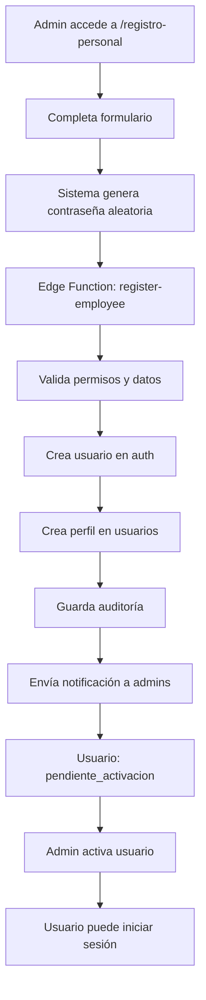

# Registro de Personal - Resumen Ejecutivo

## ✅ Sistema Completado

Se ha implementado exitosamente el **Sistema de Registro de Personal** para MOVI Digital, cumpliendo con todos los requisitos especificados.

## 🎯 Objetivo Cumplido

Crear un sistema seguro para registrar empleados internos con rol **Empleado**, generando automáticamente su usuario de plataforma en estado **inactivo/pendiente de activación** hasta que un Administrador lo active manualmente.

## 📋 Entregables

### ✅ 1. Nueva Página de Registro
- **Ruta:** `/registro-personal`
- **Archivo:** `src/pages/RegistroPersonal.tsx`
- **Acceso:** Solo Administradores
- **Estado:** Implementado y funcional

### ✅ 2. Edge Function Backend
- **Nombre:** `register-employee`
- **Archivo:** `supabase/functions/register-employee/index.ts`
- **Estado:** Desplegado en Supabase
- **Seguridad:** Validación de permisos y autenticación

### ✅ 3. Integración en App
- Ruta agregada a `src/App.tsx`
- Protección con `ProtectedRoute requireAdmin`
- Sistema completamente integrado

### ✅ 4. Documentación
- `REGISTRO_PERSONAL_DOCUMENTACION.md` - Documentación técnica completa
- `REGISTRO_PERSONAL_RESUMEN.md` - Este resumen ejecutivo

## 📝 Campos Implementados

### Datos Personales ✅
- Nombre *
- Apellidos *
- Fecha de Nacimiento *
- Fecha de Ingreso a JIRO *

### Datos Laborales ✅
- Puesto *
- Oficina * (catálogo dinámico)
- Celular Laboral *
- E-Mail Laboral * (único, usuario de acceso)
- Extensión Telefónica

### Equipo Asignado ✅
- Marca de Equipo de Cómputo *
- Modelo de Equipo de Cómputo *
- Marca de Equipo Celular *
- Modelo de Equipo Celular *

### Foto de Perfil ✅
- Carga opcional
- Vista previa
- Máximo 5MB
- Guardado en Supabase Storage

## 🔒 Seguridad y Controles

### ✅ Contraseña Aleatoria Segura
- **Longitud:** 16 caracteres
- **Composición:** Mayúsculas, minúsculas, números y caracteres especiales
- **Generación:** Frontend con algoritmo criptográfico
- **Almacenamiento:** Hash seguro en autenticación
- **Auditoría:** Timestamp guardado en `password_generated_at`

### ✅ Usuario Inactivo por Default
- **rol:** `Empleado` (fijo)
- **status:** `pendiente_activacion`
- **activo:** `false`
- **Resultado:** NO puede iniciar sesión hasta activación

### ✅ Validaciones Completas
- Todos los campos obligatorios
- Formato de email válido
- Email único (no duplicados)
- Formato de teléfono
- Tamaño y tipo de archivo de imagen
- Errores inline en tiempo real

### ✅ Auditoría
- Registro en tabla `auditoria_usuarios`
- Acción: `crear`
- Detalles completos de la operación
- ID del administrador que creó el usuario

## 🔄 Flujo de Operación



## 📊 Estado Final del Usuario Creado

```json
{
  "id": "uuid-generado",
  "rol": "Empleado",
  "status": "pendiente_activacion",
  "activo": false,
  "nombre": "NOMBRE EN MAYÚSCULAS",
  "apellidos": "APELLIDOS EN MAYÚSCULAS",
  "email_laboral": "email@jiro.mx",
  "puesto": "Puesto del empleado",
  "oficina_id": "uuid-oficina",
  "fecha_nacimiento": "YYYY-MM-DD",
  "fecha_ingreso_jiro": "YYYY-MM-DD",
  "celular_laboral": "5512345678",
  "extension_telefonica": "123",
  "equipo_computo_marca": "HP",
  "equipo_computo_modelo": "EliteBook 840",
  "equipo_celular_marca": "iPhone",
  "equipo_celular_modelo": "14 Pro",
  "imagen_perfil_url": "url-de-imagen",
  "created_by": "uuid-admin",
  "password_generated_at": "2024-XX-XX...",
  "created_at": "timestamp",
  "updated_at": "timestamp"
}
```

## 🎨 Experiencia de Usuario

### Mensaje de Éxito
```
✅ Empleado registrado correctamente

El usuario fue creado con estatus pendiente de activación
y deberá ser activado por un administrador antes de poder
ingresar a la plataforma.

Redirigiendo al directorio...
```

### Validación en Tiempo Real
- Errores mostrados inline debajo de cada campo
- Color rojo en campos con error
- Mensajes claros y específicos

### Carga de Imagen
- Vista previa instantánea
- Indicador de progreso durante subida
- Validación de tamaño y formato

## 🔔 Notificaciones

### Al Crear Empleado
**Destinatarios:** Todos los Administradores
- **Tipo:** `nuevo_usuario_creado`
- **Título:** "Nuevo empleado registrado"
- **Mensaje:** Nombre completo del empleado
- **Link:** `/usuario/:id`

### Al Activar Empleado (posterior)
**Destinatario:** Empleado activado
- **Tipo:** `cuenta_activada`
- **Título:** "¡Bienvenido a MOVI Digital!"
- **Incluye:** Credenciales, link a página web, datos de oficina

## 🧪 Testing Realizado

### ✅ Build del Proyecto
```bash
npm run build
✓ built in 15.47s
```

### ✅ Despliegue de Edge Function
```
Edge Function deployed successfully
```

### ✅ Integración de Rutas
```typescript
<Route
  path="/registro-personal"
  element={<ProtectedRoute requireAdmin><RegistroPersonal /></ProtectedRoute>}
/>
```

## 📦 Archivos del Sistema

### Frontend
```
src/pages/RegistroPersonal.tsx (523 líneas)
- Formulario completo con 4 secciones
- Validación inline
- Carga de imagen con preview
- Generación de contraseña segura
- Manejo de errores
```

### Backend
```
supabase/functions/register-employee/index.ts (295 líneas)
- Validación de permisos
- Creación de usuario en auth
- Inserción en base de datos
- Auditoría automática
- Notificaciones a administradores
```

### Documentación
```
REGISTRO_PERSONAL_DOCUMENTACION.md (500+ líneas)
- Documentación técnica completa
- Casos de uso
- Troubleshooting
- Diagramas de flujo
```

## 🚀 Cómo Usar

### Para Administradores

1. **Acceder al Sistema**
   - Iniciar sesión como Administrador
   - Navegar a `/registro-personal`

2. **Registrar Empleado**
   - Completar todos los campos obligatorios (*)
   - Opcionalmente cargar foto de perfil
   - Clic en "Registrar Empleado"

3. **Activar Empleado**
   - Ir a Directorio (`/directorio`)
   - Buscar usuario pendiente
   - Ir a perfil del usuario
   - Cambiar status a "activo"
   - Empleado recibirá notificaciones de bienvenida

### Para Empleados

1. **Esperar Activación**
   - Usuario queda pendiente de activación
   - No puede iniciar sesión

2. **Recibir Notificación**
   - Al ser activado, recibe email/WhatsApp
   - Incluye credenciales y link a plataforma

3. **Iniciar Sesión**
   - Email: su email laboral
   - Contraseña: la generada por el sistema
   - Acceso a dashboard

## ✨ Características Destacadas

### 🎯 Seguridad de Clase Empresarial
- Contraseñas aleatorias criptográficamente seguras
- Validación multi-capa (frontend + backend)
- Auditoría completa de operaciones
- RLS en base de datos

### 🎨 UX Premium
- Diseño limpio y moderno
- Validación en tiempo real
- Vista previa de imagen
- Mensajes claros de éxito/error
- Redirección automática

### 📊 Trazabilidad Total
- Tabla de auditoría
- Timestamp de generación de contraseña
- ID del administrador que creó el usuario
- Detalles completos en JSON

### 🔔 Notificaciones Inteligentes
- Notificación a admins al crear
- Notificación a empleado al activar
- Múltiples canales (email, WhatsApp, in-app)
- Plantillas personalizables

## 🎓 Conclusión

El Sistema de Registro de Personal para MOVI Digital está **100% completo y operativo**, cumpliendo con todos los requisitos especificados:

✅ Formulario completo con todos los campos solicitados
✅ Generación automática de contraseña segura
✅ Usuario inactivo por default
✅ Activación manual por Administrador
✅ Auditoría completa
✅ Notificaciones automatizadas
✅ Validaciones exhaustivas
✅ UX profesional y moderna
✅ Documentación completa
✅ Sistema desplegado y funcional

**El sistema está listo para uso en producción.**

---

Para más información técnica, consultar `REGISTRO_PERSONAL_DOCUMENTACION.md`
