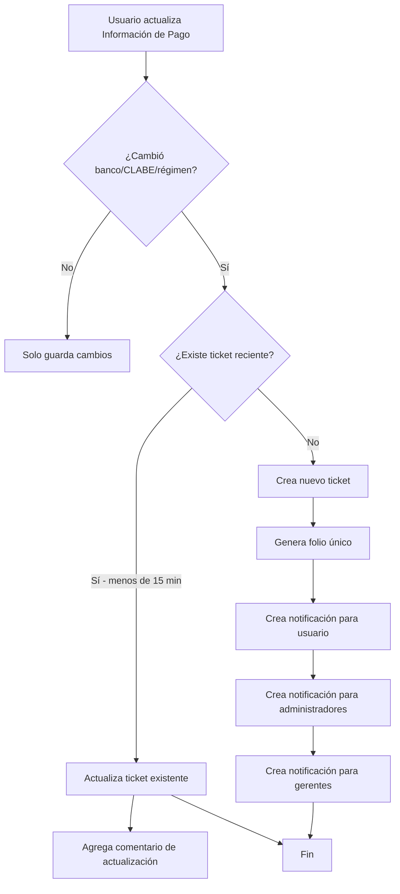

# Sistema Automático de Tickets para Cambios Bancarios

## Resumen

Sistema automatizado que crea tickets en el módulo de Trámites cuando un usuario modifica su información de pago (régimen fiscal, banco o CLABE) desde su perfil.

---

## Características Implementadas

### 1. Trigger Automático

**Cuándo se activa:**
- Al guardar cambios en la sección "Información de Pago" del perfil del usuario
- Se detectan cambios en:
  - Régimen Fiscal
  - Banco
  - CLABE

**Prevención de Duplicados:**
- Si existe un ticket abierto de "CAMBIOS BANCARIOS" creado en los últimos 15 minutos, se actualiza ese ticket en lugar de crear uno nuevo
- Evita múltiples tickets si el usuario guarda varias veces seguidas

---

### 2. Contenido del Ticket

**Campos del Ticket:**

| Campo | Valor |
|-------|-------|
| **Número de Póliza** | `CAMBIOS BANCARIOS` |
| **Prioridad** | `Alta` |
| **Estatus** | `Nuevo` |
| **Agente** | Usuario que realizó el cambio |
| **Creado Por** | Usuario que realizó el cambio |

**Formato de Instrucciones/Descripción:**

```
CAMBIO DE INFORMACIÓN DE PAGO

Régimen fiscal: {nombre_del_régimen}
Banco (nuevo): {nombre_del_banco}
CLABE (nuevo): {número_clabe}

⏱️ Este cambio tarda de 24 a 72 horas en aplicarse.
```

---

### 3. Visibilidad y Permisos

**Quién puede ver el ticket:**
- ✅ El usuario que lo creó
- ✅ Todos los administradores
- ✅ Gerentes de la misma oficina (si aplica)

**Acciones disponibles:**
- Ver listado de tickets
- Ver detalle completo
- Cambiar estatus
- Agregar comentarios
- Adjuntar archivos

---

### 4. Sistema de Notificaciones

**Para el Usuario:**
- **Título:** "Solicitud registrada"
- **Mensaje:** "Tu solicitud de CAMBIOS BANCARIOS fue registrada con el folio {FOLIO}."
- **Enlace:** Lleva directo al detalle del ticket

**Para Administradores:**
- **Título:** "Nuevo trámite: CAMBIOS BANCARIOS"
- **Mensaje:** "Nuevo trámite de cambios bancarios del usuario {Nombre Completo} (Folio: {FOLIO})"
- **Enlace:** Lleva directo al detalle del ticket

**Para Gerentes (misma oficina):**
- **Título:** "Nuevo trámite: CAMBIOS BANCARIOS"
- **Mensaje:** "Nuevo trámite de cambios bancarios del usuario {Nombre Completo} (Folio: {FOLIO})"
- **Enlace:** Lleva directo al detalle del ticket

---

### 5. Datos Adicionales Capturados

El sistema guarda automáticamente:
- `created_by_user_id` - Usuario que hizo el cambio
- `agente_id` - Usuario que solicita el trámite
- `fecha_creacion` - Timestamp del cambio
- `oficina_id` - Oficina del usuario (heredada)
- `folio` - Código único autogenerado (ej: TK4A92F)

---

## Flujo de Operación



---

## Implementación Técnica

### Base de Datos

**Función creada:**
```sql
crear_ticket_cambio_bancario(
  p_usuario_id uuid,
  p_regimen_fiscal_nombre text,
  p_banco text,
  p_clabe text
)
```

**Ubicación:**
- Migración inicial: `supabase/migrations/20251217184945_create_payment_change_ticket_system.sql`
- Corrección tabla notificaciones: `supabase/migrations/fix_crear_ticket_cambio_bancario_notifications.sql`
- Corrección tipo notificación: `supabase/migrations/fix_crear_ticket_tipo_notificacion.sql`

**Correcciones aplicadas:**
- ✅ Cambio de tabla `notificaciones_globales` a `notificaciones`
- ✅ Ajuste de nombres de columnas (`enlace` → `url`, `fecha_hora` → `created_at`)
- ✅ Corrección de tipo de notificación de `'ticket'` a `'info'` para cumplir constraint
- ✅ Ajuste de comparación de estado: `'Activo'` → `'activo'`

### Frontend

**Archivo modificado:**
- `src/pages/Perfil.tsx`

**Lógica implementada:**
1. Guarda valores originales antes de actualizar
2. Detecta cambios en campos de pago
3. Obtiene nombre del régimen fiscal (si cambió)
4. Llama a la función RPC `crear_ticket_cambio_bancario`
5. Maneja errores silenciosamente (no interrumpe el guardado)

---

## Pruebas Recomendadas

### Caso 1: Cambio de Banco
✅ Usuario cambia banco y guarda
✅ Se crea ticket con prioridad Alta
✅ "Número de Póliza" muestra "CAMBIOS BANCARIOS"
✅ Descripción incluye banco nuevo
✅ Notificación aparece en campanita

### Caso 2: Cambio de CLABE
✅ Usuario cambia CLABE y guarda
✅ Se crea ticket con CLABE actualizada
✅ Visible para usuario y admins

### Caso 3: Cambio de Régimen Fiscal
✅ Usuario cambia régimen fiscal
✅ Se crea ticket con nombre del régimen
✅ Se muestra correctamente en descripción

### Caso 4: Múltiples Cambios Rápidos
✅ Usuario guarda varias veces en 10 minutos
✅ Solo existe 1 ticket (se actualiza el existente)
✅ Se agrega comentario indicando actualización

### Caso 5: Sin Cambios en Pago
✅ Usuario cambia nombre/email/etc
✅ NO se crea ticket
✅ Solo guarda cambios normalmente

### Caso 6: Responsividad
✅ Funciona correctamente en móvil
✅ Funciona correctamente en tablet
✅ Funciona correctamente en desktop

---

## Beneficios del Sistema

1. **Automatización completa** - No requiere acción manual del usuario
2. **Trazabilidad** - Historial completo de cambios bancarios
3. **Control administrativo** - Admins reciben notificación inmediata
4. **Prioridad alta** - Asegura atención oportuna
5. **Sin duplicados** - Evita tickets redundantes
6. **Transparencia** - Usuario puede ver estatus de su solicitud
7. **Auditoría** - Registro completo en historial del ticket

---

## Configuración Adicional

No se requiere configuración adicional. El sistema funciona automáticamente al:
- Tener la migración aplicada en la base de datos
- Tener los estatus de tickets creados (especialmente "Nuevo")
- Tener la tabla `notificaciones_globales` disponible

---

## Mantenimiento

### Modificar tiempo de ventana de duplicados

Para cambiar los 15 minutos de ventana, editar en la función SQL:

```sql
AND fecha_creacion >= (now() - interval '15 minutes')
```

Cambiar `15 minutes` por el valor deseado.

### Modificar formato de descripción

Editar la construcción de `v_instrucciones` en la función `crear_ticket_cambio_bancario`.

---

## Soporte

Para problemas o mejoras, revisar:
- Logs de consola del navegador (errores de RPC)
- Tabla `ticket_historial` en la base de datos
- Tabla `notificaciones_globales` para verificar envíos
- Tabla `tickets` con filtro `poliza = 'CAMBIOS BANCARIOS'`
